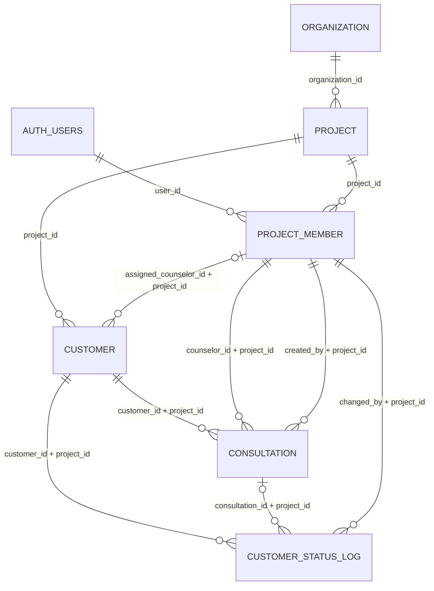

# DecisionOS Phase 1 Schema and Entities

이 문서는 Cursor가 Phase 1 데이터베이스를 구현할 때 사용하는 정규 기준이다. 원본 v1.2 논리 스키마 중 Phase 1 범위만 구체화하며, 충돌 시 다음 우선순위를 적용한다.

1. 이 문서의 Phase 1 범위·권한 결정
2. `docs/superpowers/specs/2026-08-27-decisionos-mvp-phase1-design.md`
3. `/Users/apple/Downloads/DecisionOS_논리스키마_v1.2.md`

## 1. Entity relationship



보안 경계는 `organization`이 아니라 `project`다. 모든 업무 행은 자신의 `project_id`를 직접 보유하고, 프로젝트 소속 여부는 `project_member.user_id = auth.uid()`로 판정한다.

## 2. PostgreSQL enum types

| 타입명 | 값 |
|---|---|
| `organization_status` | `ACTIVE`, `INACTIVE` |
| `project_status` | `ACTIVE`, `CLOSED` |
| `project_member_role` | `COUNSELOR`, `TEAM_LEAD`, `PROJECT_ADMIN` |
| `customer_status` | `ACTIVE`, `ARCHIVED` |
| `customer_grade` | `A`, `B`, `C` |
| `consultation_ai_status` | `PENDING`, `COMPLETED`, `FAILED`, `LOW_CONFIDENCE` |
| `consultation_density_level` | `SIMPLE_INQUIRY`, `INTEREST`, `SUBSTANTIVE`, `ACTION` |

`TEAM_LEAD`는 호환성 목적으로만 존재한다. Phase 1 RLS와 RPC에는 이 역할을 허용하는 분기가 없어야 한다.

## 3. organization

| 컬럼 | PostgreSQL 타입 | Null | 기본값/제약 |
|---|---|---|---|
| `id` | `uuid` | NOT NULL | PK, `gen_random_uuid()` |
| `name` | `varchar(200)` | NOT NULL | 빈 문자열 금지 |
| `status` | `organization_status` | NOT NULL | `ACTIVE` |
| `created_at` | `timestamptz` | NOT NULL | `now()` |
| `updated_at` | `timestamptz` | NOT NULL | `now()` |

관계·정책:

- 물리삭제 금지, 상태 변경으로만 비활성화한다.
- Phase 1 UI는 INSERT/UPDATE/DELETE를 제공하지 않는다.
- 활성 프로젝트 멤버는 자신의 프로젝트가 속한 조직만 조회할 수 있다.

## 4. project

| 컬럼 | PostgreSQL 타입 | Null | 기본값/제약 |
|---|---|---|---|
| `id` | `uuid` | NOT NULL | PK, `gen_random_uuid()` |
| `organization_id` | `uuid` | NOT NULL | FK `organization.id`, DELETE RESTRICT |
| `name` | `varchar(200)` | NOT NULL | 빈 문자열 금지 |
| `timezone` | `varchar(50)` | NOT NULL | `Asia/Seoul` |
| `status` | `project_status` | NOT NULL | `ACTIVE` |
| `created_at` | `timestamptz` | NOT NULL | `now()` |
| `updated_at` | `timestamptz` | NOT NULL | `now()` |

인덱스:

- `idx_project_org (organization_id)`

주의:

- `project`에는 `project_id` 컬럼이 없다.
- 잘못된 `UNIQUE(id, project_id)`를 만들지 않는다.
- 자식 테이블은 `project_id → project.id` 단일 FK로 참조한다.
- Phase 1 UI는 프로젝트 생성/수정/삭제를 제공하지 않는다.

## 5. project_member

| 컬럼 | PostgreSQL 타입 | Null | 기본값/제약 |
|---|---|---|---|
| `id` | `uuid` | NOT NULL | PK, `gen_random_uuid()` |
| `project_id` | `uuid` | NOT NULL | FK `project.id`, DELETE RESTRICT |
| `user_id` | `uuid` | NOT NULL | FK `auth.users.id`, DELETE RESTRICT |
| `role` | `project_member_role` | NOT NULL |  |
| `active` | `boolean` | NOT NULL | `true` |
| `created_at` | `timestamptz` | NOT NULL | `now()` |
| `updated_at` | `timestamptz` | NOT NULL | `now()` |

제약·인덱스:

- `UNIQUE(project_id, user_id)`
- `UNIQUE(id, project_id)`
- `idx_pm_project_active (project_id, active)`
- RLS 지원 인덱스 `idx_pm_user_active_project_role (user_id, active, project_id, role)`

정책:

- 물리삭제하지 않고 `active=false`로 처리한다.
- COUNSELOR는 자신의 활성 멤버십만 조회한다.
- PROJECT_ADMIN은 자신의 활성 멤버십과 동일한 프로젝트의 구성원을 조회한다.
- Phase 1에서는 어느 역할도 구성원을 직접 INSERT/UPDATE/DELETE하지 않는다.

## 6. customer

| 컬럼 | PostgreSQL 타입 | Null | 기본값/제약 |
|---|---|---|---|
| `id` | `uuid` | NOT NULL | PK, `gen_random_uuid()` |
| `project_id` | `uuid` | NOT NULL | FK `project.id`, DELETE RESTRICT |
| `name` | `varchar(100)` | NOT NULL | 빈 문자열 금지 |
| `phone` | `varchar(20)` | NOT NULL |  |
| `phone_normalized` | `varchar(20)` | NOT NULL | 정규식 `^[0-9]+$` |
| `status` | `customer_status` | NOT NULL | `ACTIVE` |
| `grade` | `customer_grade` | NOT NULL | `C` |
| `suggested_grade` | `customer_grade` | NULL | Phase 1 UI 미사용 |
| `suggested_score` | `smallint` | NULL | 0 이상 |
| `suggested_grade_reason` | `text` | NULL | Phase 1 UI 미사용 |
| `suggestion_rule_version` | `varchar(20)` | NULL | Phase 1 UI 미사용 |
| `suggested_at` | `timestamptz` | NULL | Phase 1 UI 미사용 |
| `source` | `varchar(50)` | NULL |  |
| `assigned_counselor_id` | `uuid` | NULL | 아래 복합 FK |
| `created_at` | `timestamptz` | NOT NULL | `now()` |
| `updated_at` | `timestamptz` | NOT NULL | `now()` |

제약·인덱스:

- `UNIQUE(project_id, phone_normalized)`
- `UNIQUE(id, project_id)`
- 복합 FK `(assigned_counselor_id, project_id) → project_member(id, project_id) ON DELETE RESTRICT`
- `idx_customer_project_grade (project_id, grade)`
- `idx_customer_project_phone (project_id, phone_normalized)`
- `idx_customer_project_status (project_id, status)`
- RLS/담당자 조회 인덱스 `idx_customer_project_assignee (project_id, assigned_counselor_id)`

정책:

- COUNSELOR 조회 조건은 같은 프로젝트의 활성 COUNSELOR 멤버십이며 `project_member.id = customer.assigned_counselor_id`인 경우다.
- PROJECT_ADMIN은 자신의 활성 관리자 멤버십과 동일한 프로젝트의 고객을 조회한다.
- `grade`와 `assigned_counselor_id`는 직접 UPDATE하지 않고 지정 RPC만 사용한다.
- 물리삭제하지 않고, 후속 단계에서 오등록/중복은 `status=ARCHIVED`로 처리한다.

## 7. consultation

| 컬럼 | PostgreSQL 타입 | Null | 기본값/제약 |
|---|---|---|---|
| `id` | `uuid` | NOT NULL | PK, `gen_random_uuid()` |
| `project_id` | `uuid` | NOT NULL | FK `project.id`, DELETE RESTRICT |
| `customer_id` | `uuid` | NOT NULL | 아래 복합 FK |
| `counselor_id` | `uuid` | NOT NULL | 아래 복합 FK |
| `consulted_at` | `timestamptz` | NOT NULL |  |
| `content` | `text` | NOT NULL | 빈 문자열 금지 |
| `content_version` | `integer` | NOT NULL | `1`, 1 이상 |
| `next_action_at` | `timestamptz` | NULL |  |
| `grade_after` | `customer_grade` | NULL | RPC가 기록한 상담 시점 등급 |
| `created_by` | `uuid` | NOT NULL | 아래 복합 FK |
| `ai_analysis_status` | `consultation_ai_status` | NOT NULL | `PENDING` |
| `ai_analyzed_content_version` | `integer` | NULL |  |
| `ai_density_level` | `consultation_density_level` | NULL |  |
| `ai_confidence` | `numeric(3,2)` | NULL | 0~1 |
| `ai_evidence_summary` | `text` | NULL |  |
| `ai_analyzed_at` | `timestamptz` | NULL |  |
| `ai_prompt_version` | `varchar(20)` | NULL |  |
| `ai_retry_count` | `smallint` | NOT NULL | `0`, 0 이상 |
| `ai_last_attempted_at` | `timestamptz` | NULL |  |
| `ai_failure_reason` | `text` | NULL |  |
| `created_at` | `timestamptz` | NOT NULL | `now()` |
| `updated_at` | `timestamptz` | NOT NULL | `now()` |

제약·인덱스:

- `UNIQUE(id, project_id)`
- `(customer_id, project_id) → customer(id, project_id) ON DELETE RESTRICT`
- `(counselor_id, project_id) → project_member(id, project_id) ON DELETE RESTRICT`
- `(created_by, project_id) → project_member(id, project_id) ON DELETE RESTRICT`
- v1.2의 AI 상태별 필드 조합 CHECK를 그대로 적용한다.
- `idx_consultation_customer_time (customer_id, consulted_at DESC)`
- `idx_consultation_ai_status (ai_analysis_status)`
- RLS 지원 인덱스 `idx_consultation_project_customer_time (project_id, customer_id, consulted_at DESC)`

정책:

- 상담 등록과 수정은 직접 INSERT/UPDATE하지 않고 RPC를 사용한다.
- COUNSELOR는 현재 자신에게 배정된 고객의 상담만 조회한다.
- PROJECT_ADMIN은 같은 프로젝트의 상담을 조회하지만 Phase 1에서는 등록·수정하지 않는다.
- 물리삭제는 금지한다.

## 8. customer_status_log

| 컬럼 | PostgreSQL 타입 | Null | 기본값/제약 |
|---|---|---|---|
| `id` | `uuid` | NOT NULL | PK, `gen_random_uuid()` |
| `project_id` | `uuid` | NOT NULL | FK `project.id`, DELETE RESTRICT |
| `customer_id` | `uuid` | NOT NULL | 아래 복합 FK |
| `consultation_id` | `uuid` | NULL | 아래 복합 FK |
| `grade_before` | `customer_grade` | NULL | 최초 기록 허용 |
| `grade_after` | `customer_grade` | NOT NULL |  |
| `suggested_grade_at_time` | `customer_grade` | NULL |  |
| `reason` | `text` | NULL |  |
| `changed_by` | `uuid` | NOT NULL | 아래 복합 FK |
| `changed_at` | `timestamptz` | NOT NULL | `now()` |

제약·인덱스:

- `(customer_id, project_id) → customer(id, project_id) ON DELETE RESTRICT`
- `(consultation_id, project_id) → consultation(id, project_id) ON DELETE RESTRICT`
- `(changed_by, project_id) → project_member(id, project_id) ON DELETE RESTRICT`
- `idx_status_log_customer_time (customer_id, changed_at DESC)`
- RLS 지원 인덱스 `idx_status_log_project_customer_time (project_id, customer_id, changed_at DESC)`

정책:

- 애플리케이션 역할의 직접 INSERT/UPDATE/DELETE를 모두 금지한다.
- 지정된 등급 변경 RPC만 INSERT할 수 있다.
- COUNSELOR는 현재 담당 고객의 이력만, PROJECT_ADMIN은 같은 프로젝트 이력만 조회한다.
- 로그는 불변이다.

## 9. updated_at behavior

`organization`, `project`, `project_member`, `customer`, `consultation`에 공통 BEFORE UPDATE 트리거를 적용한다. 트리거 함수는 `private`에 두고 항상 `NEW.updated_at = statement_timestamp()`를 설정한다. `customer_status_log`는 불변 로그이므로 `updated_at` 컬럼이나 갱신 트리거를 두지 않는다.

## 10. RLS helper contracts

구현 이름과 타입은 다음으로 고정한다.

```text
private.current_project_member_id(
  p_project_id uuid,
  p_allowed_roles project_member_role[]
) -> uuid | null

private.has_project_role(
  p_project_id uuid,
  p_allowed_roles project_member_role[]
) -> boolean
```

두 함수 모두 `auth.uid()`를 내부에서 직접 읽고 `project_member.active = true`, `project.status = 'ACTIVE'`, `organization.status = 'ACTIVE'`를 검사한다. `TEAM_LEAD`를 호출 측 배열에 포함하는 정책이나 RPC를 만들지 않는다.

## 11. RPC contracts

```text
api.record_consultation(
  p_customer_id uuid,
  p_consulted_at timestamptz,
  p_content text,
  p_next_action_at timestamptz default null,
  p_grade_after customer_grade default null,
  p_reason text default null
) -> mutation_result

api.update_consultation(
  p_consultation_id uuid,
  p_content text,
  p_next_action_at timestamptz default null
) -> mutation_result

api.change_customer_grade(
  p_customer_id uuid,
  p_grade customer_grade,
  p_reason text default null
) -> mutation_result

api.assign_customer_counselor(
  p_customer_id uuid,
  p_assignee_project_member_id uuid default null
) -> mutation_result

api.list_project_counselors(
  p_project_id uuid
) -> setof counselor_option
```

권장 반환 구조:

```text
mutation_result {
  entity_id uuid,
  code text
}

counselor_option {
  project_member_id uuid,
  display_label text
}
```

성공 코드는 `OK`로 통일한다. 실패는 PostgreSQL 예외의 안정적인 SQLSTATE/메시지 코드로 구분하며 최소한 다음 애플리케이션 코드를 제공한다.

| 코드 | 의미 |
|---|---|
| `AUTH_REQUIRED` | 유효한 로그인 없음 |
| `ACCESS_DENIED` | 역할·프로젝트·담당 고객 조건 불충족 |
| `ENTITY_NOT_FOUND` | 접근 가능한 대상 없음 |
| `INVALID_ASSIGNEE` | 같은 프로젝트의 활성 COUNSELOR가 아님 |
| `GRADE_UNCHANGED` | 변경 전후 등급 동일 |
| `INVALID_CONTENT` | 상담 내용이 비어 있음 |
| `CONCURRENT_CHANGE` | 잠금/버전 조건 충돌 |

`ACCESS_DENIED`와 `ENTITY_NOT_FOUND`의 브라우저 메시지는 프로젝트나 UUID 존재 여부가 노출되지 않도록 같은 문구로 표시한다.

## 12. TypeScript entity boundary

Prisma/Drizzle/수동 ORM 엔티티를 만들지 않는다. Supabase CLI가 생성한 `Database` 타입을 단일 DB 타입 원천으로 사용한다.

```text
OrganizationRow = Database['public']['Tables']['organization']['Row']
ProjectRow = Database['public']['Tables']['project']['Row']
ProjectMemberRow = Database['public']['Tables']['project_member']['Row']
CustomerRow = Database['public']['Tables']['customer']['Row']
ConsultationRow = Database['public']['Tables']['consultation']['Row']
CustomerStatusLogRow = Database['public']['Tables']['customer_status_log']['Row']
```

UI용 조합 모델만 feature 폴더에 명시적으로 둔다.

```text
ProjectMembershipContext {
  project: ProjectRow
  membership: Pick<ProjectMemberRow, 'id' | 'project_id' | 'role' | 'active'>
}

CustomerListItem {
  customer: Pick<CustomerRow,
    'id' | 'project_id' | 'name' | 'phone' | 'grade' |
    'status' | 'assigned_counselor_id' | 'source' | 'updated_at'>
  nextActionAt: string | null
}

CustomerDetailModel {
  customer: CustomerRow
  consultations: ConsultationRow[]
  gradeHistory: CustomerStatusLogRow[]
}

CounselorOption {
  projectMemberId: string
  displayLabel: string
}
```

서버 액션 입력 타입은 Zod 스키마에서 추론하고, 브라우저가 보낸 `projectId`, `role`, `actingMemberId`는 RPC 권한 근거로 전달하지 않는다.

## 13. Migration order

Cursor는 아래 이름으로 `supabase migration new`를 각각 실행하고, CLI가 만든 파일명을 그대로 사용한다.

1. `phase1_schema`
2. `phase1_rls`
3. `phase1_rpcs`

각 단계는 이전 단계의 테스트가 통과하고 Codex 검수가 끝난 뒤 진행한다. 원격 DB에 적용하기 전 로컬 reset, pgTAP, database advisors, migration list 검증을 완료한다.
